  

## About me

I'm **Abdullah Yamin**, an **Artificial Intelligence Engineer** with a background in AI Engineering at Bahçeşehir University in Istanbul.

I build retrieval-augmented and multi-agent LLM systems, then test them hard enough to know whether they can be trusted. I'm drawn to problems where a wrong answer has a real cost: clinical decisions, official rules people rely on, and misinformation.

**How I work**

- **Show the source.** My assistants cite the document and article behind every claim.
- **Privacy by default.** Local models and synthetic data whenever people's personal data is involved.
- **Measure, then claim.** Benchmarks, ablations and error analysis come first, and I report the misses along with the wins.
- **Fail safely.** An honest "I don't know" beats a confident wrong answer.

## Featured work

**[ClinicalBridge](https://github.com/abdullahyamin/Clinical-Bridge-)** · multi-agent clinical decision support 
Four local LLM agents turn a remote patient-monitoring alert into a clinician-ready brief with a full audit trail. Evaluation caught the model writing a detail into patient summaries that wasn't in their records, and a sentence-level grounding validator took the **safety pass rate from 80% to 100%**. 
LangChain · Ollama (Llama 3.1 8B) · ChromaDB · Pydantic · runs locally on fictional patients

**[Bahçe-sihir](https://github.com/abdullahyamin/bahce-sihir)** · bilingual RAG assistant for university regulations 
Answers students' questions in Turkish or English from official university documents, citing the document and article for every claim. Finding a silent reranker cut-off lifted **precision@5 from 0.31 to 0.71**, and fixing a FAISS–PyTorch threading clash helped cut **latency from 30s+ to 6–10s**. **Zero hallucinations** on a hand-checked 15-question test. Team capstone. 
FastAPI · Gemini · sentence-transformers · BM25 · cross-encoder reranking · React · Docker

**[Fake-news detection, audited for bias](https://github.com/abdullahyamin/fake-news-detection-with-built-in-bias-analysis.)** · NLP and interpretability 
DistilBERT (**99.6% accuracy**) against a TF-IDF baseline on 44,898 articles, followed by a three-stage audit of what the models actually learned. The most influential words turned out to be about style, not substance: high accuracy isn't the same as understanding. 
PyTorch · Hugging Face Transformers · scikit-learn · LIME · Streamlit

**[Customer-churn MLOps pipeline](https://github.com/abdullahyamin/customer-churn-mlops-)** · production machine learning 
Schema-validated data in, a monitored model behind an API out: MLflow tracking and model registry, Optuna tuning, FastAPI and batch inference, PSI/KS drift monitoring, Docker, and CI that lints, tests and runs the whole pipeline. 
scikit-learn · MLflow · Optuna · FastAPI · Docker · GitHub Actions

## Toolbox

  
  
  
  
  
  
  
  
  
  
  
  
  
  
  
  

---

  <b>The full story behind each project is on my portfolio: <a href="https://abdullahyamin.github.io">abdullahyamin.github.io</a></b>

