  
  

## I build AI that shows its work.

Hi, I'm Abdullah 👋 My systems cite their sources, keep private data private, and say *"I don't know"* instead of guessing. Then I try to break them before anyone relies on them.

📍 Kuwait · open to relocation &nbsp;&nbsp;🎓 B.Sc. AI Engineering, 2026

**How I work**

- 🔎 **Show the source.** Every answer points to where it came from.
- 🔒 **Privacy by default.** Local models and synthetic data when real people are involved.
- 📏 **Measure, then claim.** Benchmarks and error analysis before conclusions, misses included.
- 🛑 **Fail safely.** An honest "I don't know" beats a confident wrong answer.

## Featured work

**VisaDocs** · checks visa paperwork before people pay the fee · 🔒 private, in development 
Tells applicants exactly which documents their route requires, drawn from official government and embassy sources. It already covers **16,750 routes** (250 nationalities × 67 destinations) plus student permits for 148 destinations, clearly labels anything unverified, and is designed never to predict approval or store an uploaded document. 
Next.js · TypeScript · PostgreSQL · Prisma · two-person team · code is private

**[ClinicalBridge](https://github.com/abdullahyamin/Clinical-Bridge-)** · multi-agent clinical decision support 
Four local LLM agents turn a remote patient-monitoring alert into a clinician-ready brief with a full audit trail. Evaluation caught the model writing a detail into patient summaries that wasn't in their records, and a sentence-level grounding validator took the **safety pass rate from 80% to 100%**. 
LangChain · Ollama (Llama 3.1 8B) · ChromaDB · Pydantic · runs locally on fictional patients

**[Bahçe-sihir](https://github.com/abdullahyamin/bahce-sihir)** · bilingual RAG assistant for university regulations 
Answers students' questions in Turkish or English from official university documents, citing the document and article for every claim. Finding a silent reranker cut-off lifted **precision@5 from 0.31 to 0.71**, and fixing a FAISS–PyTorch threading clash helped cut **latency from 30s+ to 6–10s**. **Zero hallucinations** on a hand-checked 15-question test. Team capstone. 
FastAPI · Gemini · sentence-transformers · BM25 · cross-encoder reranking · React · Docker

**[Fake-news detection, audited for bias](https://github.com/abdullahyamin/fake-news-detection-with-built-in-bias-analysis.)** · NLP and interpretability 
DistilBERT (**99.6% accuracy**) against a TF-IDF baseline on 44,898 articles, followed by a three-stage audit of what the models actually learned. The most influential words turned out to be about style, not substance: high accuracy isn't the same as understanding. 
PyTorch · Hugging Face Transformers · scikit-learn · LIME · Streamlit

**[Customer-churn MLOps pipeline](https://github.com/abdullahyamin/customer-churn-mlops-)** · production machine learning 
Schema-validated data in, a monitored model behind an API out: MLflow tracking and model registry, Optuna tuning, FastAPI and batch inference, PSI/KS drift monitoring, Docker, and CI that lints, tests and runs the whole pipeline. 
scikit-learn · MLflow · Optuna · FastAPI · Docker · GitHub Actions

## Experience

**AI/ML Intern · Gulf Insurance Group, Kuwait** · Dec 2025 – Apr 2026 
AI and digital-transformation projects across enterprise insurance systems. Scored 5/5 for attendance, discipline, technical ability and teamwork.

## Toolbox

  
  
  
  
  
  
  
  
  
  
  
  
  
  
  
  
  
  

---

  <b>Open to AI engineering roles, in Kuwait or anywhere in the world.</b> 
  <a href="mailto:abdullahyamin2003@gmail.com">abdullahyamin2003@gmail.com</a> · <a href="https://www.linkedin.com/in/abdullah-yamin">LinkedIn</a> · <a href="https://abdullahyamin.github.io">Portfolio</a>

